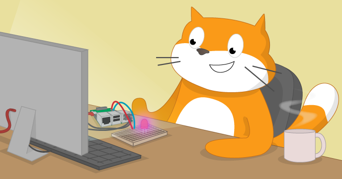

# Physical Computing With Scratch

There are a couple of versions of scratch installed on the Raspberry Pi by default, Scratch and Scratch 2.  This learning guide uses Scratch, i.e. version 1.
The versions of Scratch included with the Raspberry Pi have a number of unique features; one of the most useful is its ability to communicate with the General-Purpose Input/Output pins, or GPIO. These pins allow you to connect your Raspberry Pi to a range of devices, from lights and motors to buttons and sensors. The Raspberry Pi 2 has 40 GPIO pins, whilst the original Raspberry Pi only has 26, but this workshop will work with either model.

## Licence

Unless otherwise specified, everything in this repository is covered by the following licence:

***Physical Computing With Scratch*** by the [Raspberry Pi Foundation](http://www.raspberrypi.org) is licenced under a [Creative Commons Attribution 4.0 International License](http://creativecommons.org/licenses/by-sa/4.0/).

Based on a work at https://github.com/raspberrypilearning/physical-computing-with-scratch
