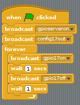

# Buzzers

There are two main types of buzzer: *active* and *passive*.

A *passive* buzzer emits a tone when a voltage is applied across it. It also requires a specific signal to generate a variety of tones. The *active* buzzers are a lot simpler to use, so these are covered here.

## Connecting a buzzer

An *active* buzzer can be connected just like an LED, but as they are a little more robust, you won't be needing a resistor to protect them.

Set up the circuit as shown below:

Now you can sound the buzzer by using the code below.

Or even make the buzzer beep.

