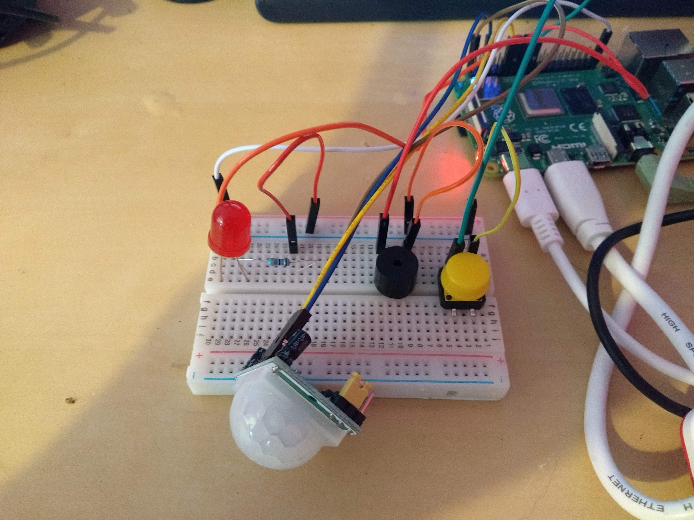

--- no-print ---

This is the **Scratch 3** version of the project. There is also a [Scratch 1.4 version of the project](https://projects.raspberrypi.org/en/projects/physical-computing-with-scratch14){:target="_blank"}.

--- /no-print ---

## Introduction

In this project you will learn how to control various electronic components using the latest version of Scratch on the Raspberry Pi.

### What you will make

--- no-print ---
<video width="640" height="360" controls>
<source src="images/alarm.webm" type="video/webm">
Your browser does not support WebM video, try FireFox or Chrome
</video>

--- /no-print ---

--- print-only ---

--- /print-only ---

--- collapse ---
---
title: What you will need
---

### Hardware

- A Raspberry Pi 4
- An LED
- A 47 - 330 ohm resistor
- A tactile button
- A buzzer
- A PIR motion sensor
- Male to Female jumper leads
- Female to Female jumper leads

### Software

Scratch 3 - if not already installed, open a terminal and type:

```bash
sudo apt install scratch3
```

### Downloads

A completed project file can be found [here](http://rpf.io/p/en/physical-computing-with-scratch-get){:target="_blank"}.
--- /collapse ---

--- collapse ---
---
title: What you will learn
---
- How to control and LED with Scratch
- How to detect button presses with Scratch
- How to detect motion with Scratch
--- /collapse ---

--- collapse ---
---
title: Additional information for educators
---
If you need to print this project, please use the [printer-friendly version](https://projects.raspberrypi.org/en/projects/physical-computing-with-scratch/print){:target="_blank"}.

You can find the [completed project here](http://rpf.io/p/en/physical-computing-with-scratch-get){:target="_blank"}.

--- /collapse ---

