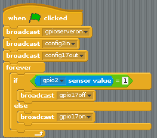

## Controlling an LED with a button push

To finish off, you can combine your two programs so that the button can turn the LED on and off.

- Adapt your script and use an `If Else` block so that it looks like the example below:

    

- Now when you push the button, the LED should light up.

