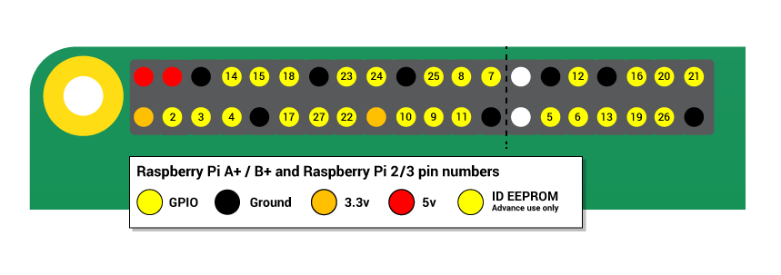

## Lighting an LED

Before you begin controlling Light Emitting Diodes (LEDs) with code, it is a good idea to test all your hardware, to make sure it is working.

The Raspberry Pi's General Purpose Input/Output (GPIO) pins can be used to power a simple LED circuit.

You can buy a [pin guide](https://thepihut.com/products/gpio-reference-board-model-b-plus-and-a-plus?ref=isp_rel_prd&isp_ref_pos=5){:target="_blank"} to help you identify the GPIO pins, use the image below, or open a terminal and type `pinout` to see the numbers of all the pins.

--- task ---
Connect your LED and resistor into Raspberry Pi as shown below.

Note that the **long** leg of the LED needs to be connected to the `3.3V` pin. The **short** leg goes to a `GND` pin
--- /task ---

The LED should now be on, so check your wiring if it does not light up.
