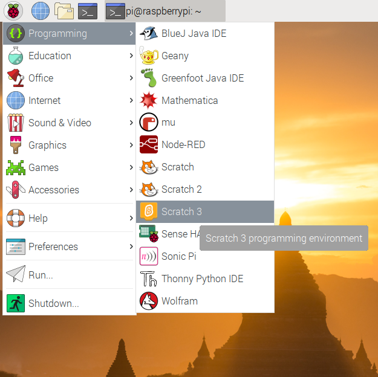
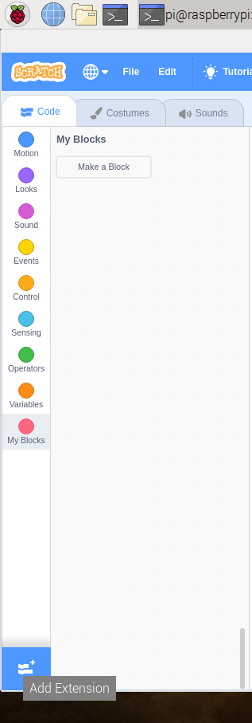

## Using a switchable pin

To control the LED, you'll need to adapt your circuit to use a switchable pin.

--- task ---
Move the lead that is connected to `3.3V` to `GPIO 17`.


--- /task ---

The LED should switch off, as this pin is not currently *on*.

--- task ---
Open Scratch 3 from the menu.


--- /task ---

--- task ---
To use the GPIO pins, you need to add in the `Raspberry Pi Simple Electronics` extension




--- /task ---

--- task ---
Now you can create a script to turn the LED on and off.

```blocks3
when flag clicked
turn LED (17 v) [on v] ::extension
wait (1) secs
turn LED (17 v) [off v] ::extension
```
--- /task ---

--- task ---
Can you make the LED flash on and off repeatedly?

--- hints --- --- hint ---
You can use a `forever`{:class="block3control"} block to make you script loop.
--- /hint --- --- hint ---
Here's the additional blocks you will need to add to your script
```blocks3
wait (1) secs

forever
```
--- /hint --- --- hint ---
Here's what the completed script would look like.
```blocks3
when flag clicked
forever
turn LED (17 v) [on v] ::extension
wait (1) secs
turn LED (17 v) [off v] ::extension
wait (1) secs
```
--- /hint --- --- /hints ---

--- /task ---
