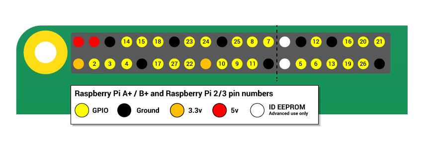

## GPIO pins

One powerful feature of the Raspberry Pi is the row of GPIO pins along the top edge of the board. GPIO stands for General-Purpose Input/Output. These pins are a physical interface between the Raspberry Pi and the outside world. At the simplest level, you can think of them as switches that you can turn on or off (input) or that the Pi can turn on or off (output).

The GPIO pins allow the Raspberry Pi to control and monitor the outside world by being connected to electronic circuits. The Pi is able to control LEDs, turning them on or off, run motors, and many other things. It's also able to detect whether a switch has been pressed, the temperature, and light. We refer to this as physical computing.

There are 40 pins on the Raspberry Pi (26 pins on early models), and they provide various different functions.

If you have a RasPiO pin label, it can help to identify what each pin is used for. Make sure your pin label is placed with the keyring hole facing the USB ports, pointed outwards.

If you don't have a pin label, then this guide can help you to identify the pin numbers:

You'll see pins labelled as 3V3, 5V, GND and GP2, GP3, etc:

|   |   |   |
|---|---|---|
| 3V3 | 3.3 volts | Anything connected to these pins will always get 3.3V of power |
| 5V | 5 volts | Anything connected to these pins will always get 5V of power |
| GND | ground | Zero volts, used to complete a circuit |
| GP2 | GPIO pin 2 | These pins are for general-purpose use and can be configured as input or output pins |
| ID_SC/ID_SD/DNC | Special purpose pins ||

**WARNING**: If you follow the instructions, then playing about with the GPIO pins is safe and fun. Randomly plugging wires and power sources into your Pi, however, may destroy it, especially if using the 5V pins. Bad things can also happen if you try to connect things to your Pi that use a lot of power; LEDs are fine, motors are not. If you're worried about this, then you might want to consider using an add-on board such as the [Explorer HAT](https://shop.pimoroni.com/products/explorer-hat) until you're confident enough to use the GPIO directly.

