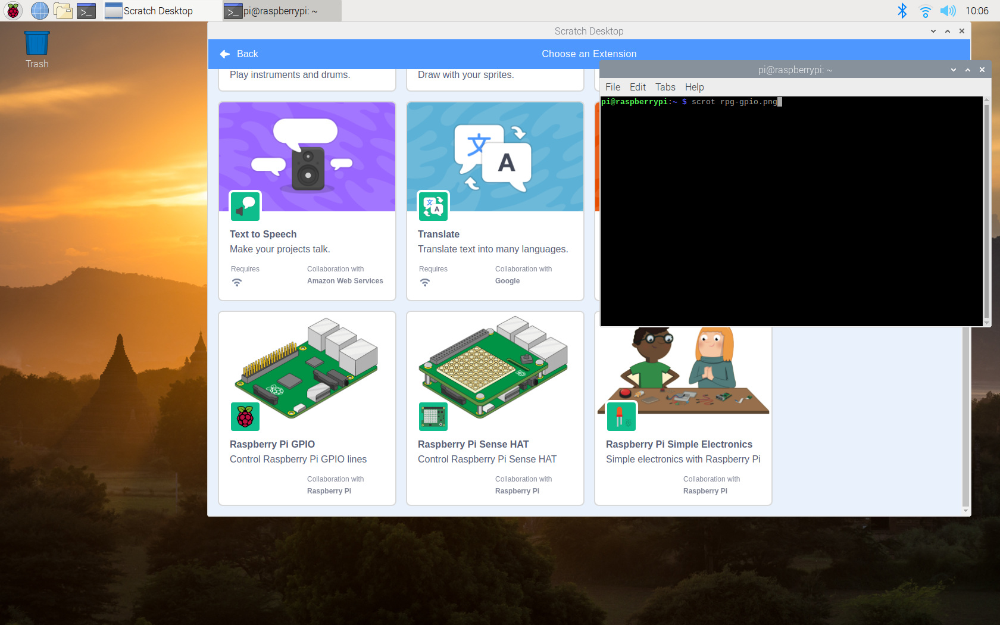

## Buzzers

You can control other electronic components using Scratch 3 on the Raspberry Pi as well.

To do this you need to add another extension.

--- task ---
Add the `Raspberry Pi GPIO` extension in Scratch 3


--- /task ---

### Connecting a buzzer

An active buzzer can be connected just like an LED, but as they are a little more robust, you won't be needing a resistor to protect them.

Set up the circuit as shown below:


### Coding a buzzer

Now you can sound the buzzer by using the code below:

```blocks3
when flag clicked
forever
set gpio (17 v) to output [high v] ::extension
wait (1) secs
set gpio (17 v) to output [low v] ::extension
wait (1) secs
```

Or even control it with your button

```blocks3
when gpio (2 v) is [high v] ::hat extension
set gpio (17 v) to output [high v] ::extension

when gpio (2 v) is [low v] ::hat extension
set gpio (17 v) to output [low v] ::extension
```


