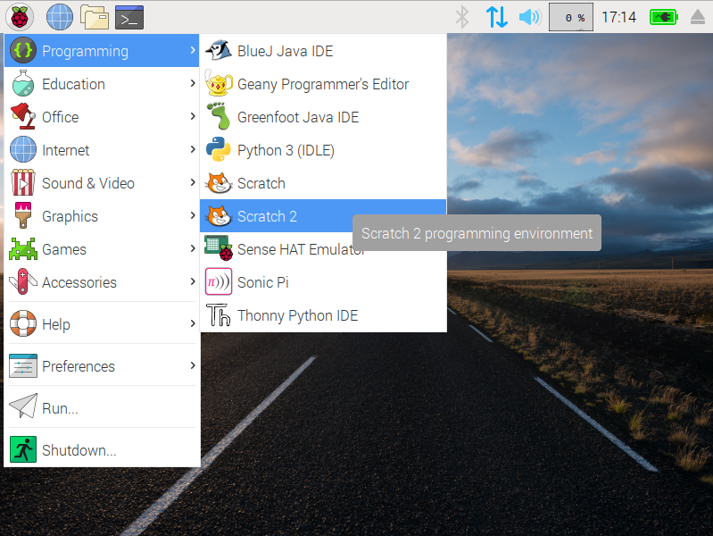
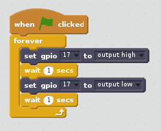

## Constructing a Scratch 2 program

1.  Locate the Scratch 2 program by clicking on **Menu** followed by **Programming**, and selecting **Scratch 2**, remember to use version 2, not version 1.

 

1. The familiar Scratch interface will then load:

 

1. We need to setup Scratch to use the GPIO pins. Click on **More Blocks** in the top right display and click on **Add an Extension**.

1. Select Pi GPIO and click on.  

1. You will see two new blocks appear, we will be using these to control and sense the GPIO pins.

1.  Click on **Events** in the top-right (Scripts tab) display. Drag the `when GreenFlag clicked` block onto the scripts area:

  

1. From this point on, you can control your LED using the two new blocks: `set gpio 17 to output high` to turn it on and `set gpio 17 to output low` to turn it off. Using these two messages and some pauses, you can make an LED flash continuously:

  
