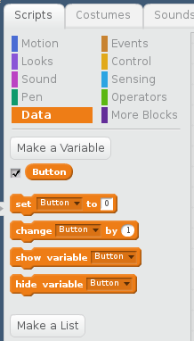
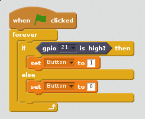

## Configuring your button

1. Assuming you have started a new Scratch file, you'll need to check the `Pi GPIO` extension is enabled with the two GPIO blocks available.

1. Next, you need to go to the Data menu in Scratch and create a new variable called `Button`:

  

1. Make sure the check box next to the new variable is checked.

1. You should now see the `button` variable in the stage area:

  

1. You'll now need a code block to read the button and update the `button` variable

1. Pull in the `when green flag clicked` block from the **Event** menu.  Place an `if, then, else` block in a `forever` block at attach to the `when green flag clicked block`

  

1. You need the block to check when the button is pressed, so add `set gpio 21 to output high` from the **more blocks** menu to the `if` block

1. From the **Data** menu drag `set button to 1` into the `then` block

1. From the **Data** menu drag `set button to 0` into the `else` block

  

1. Press the green flag to run the code

1. Now when you press your button, the state should change from 1 to 0.
