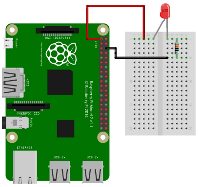
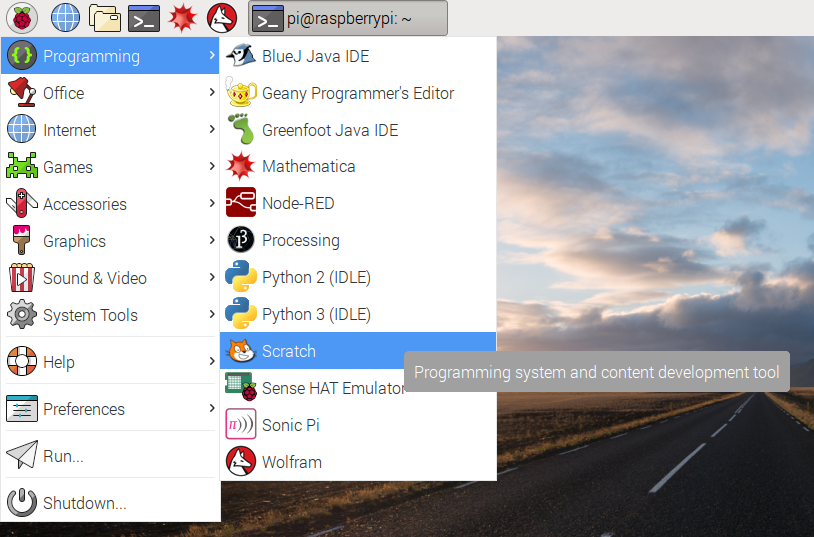
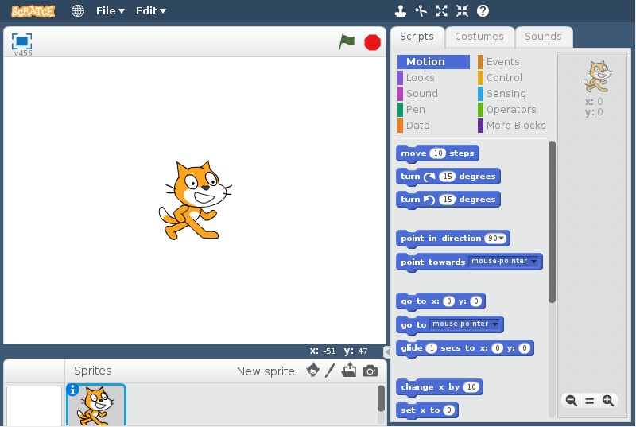
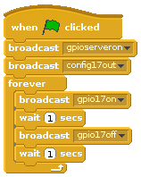
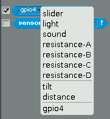
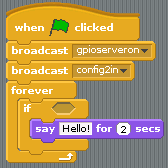
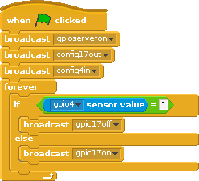

# Physical Computing with Scratch

The version of Scratch included with the Raspberry Pi has a number of unique features; one of the most useful is its ability to communicate with the **G**eneral **P**urpose **I**nput **O**utput pins, or GPIO. These pins allow you to connect your Raspberry Pi to a range of devices, from lights and motors to buttons and sensors. The Raspberry Pi 2 has 40 GPIO pins, whilst the original Raspberry Pi only has 26, but this workshop will work with either model.

The pins on the Raspberry Pi have different purposes:
- **Red** provide **5v** power (avoid using these unless specifically told to)
- **Orange** provide **3.3v** power
- **Black** - ground pins, like a negative connection on a battery
- **Yellow** -  these switchable pins can be controlled from software, either switched on or off in **output** mode or detecting changes in voltage in **input** mode.

## Lighting an LED

1. You can test whether your GPIO pins and LEDs are working by building the circuit below.

1. The LED is connected directly to the **3.3v** and **GND** pins, and should light up.

1. Be sure to connect your LED the correct way round; the longer leg should be connected to the 3v3 pin.

## Using a switchable pin

1. To control the LED, you'll need to adapt your circuit to use a switchable pin.

1. In the diagram below **pin 17** has been used, but you can use any numbered pin you wish.

## Constructing a Scratch program

1.  Locate the program **Scratch** by clicking on **Menu** followed by **Programming**, and selecting **Scratch**.

 

1. The familiar Scratch interface will then load.

 

1.  Click on **Control** in the top-left display. Drag the **when GreenFlag clicked** block onto the scripts area.

1. Scratch uses **broadcast** blocks to communicate with the GPIO pins; the first broadcast you need is `gpioserveron` which activates the GPIO functionality.

1. As your GPIO pin can be used as either input or output, you will need to specify in which mode your pin is being used with the `config17out` broadcast.

1. From this point on you can control your LED using two broadcasts: `gpio17high` to turn it on and `gpio17low` to turn it off. Using these two messages and some pauses, you can make an LED flash continuously.

## Connecting a button

1. As well as controlling the physical world, you can react to it using an input device such as a button.

1. Connect your button to a breadboard, and then connect one pin to a ground pin and the other to a numbered GPIO pin. In this example **pin 4** has been used.

## Configuring your button

1. Before Scratch can react to your button, it needs to be told which pin is configured as an input pin.

1. Assuming you have started a new Scratch file, you will also need to start the GPIO server. The following code will configure pin 4 as an input.

  

1. Once you have built the code above, you need to click the green flag in order for it to run and your pin to be set up.

1. Next, you need to go to the Sensing menu in Scratch.

  

1. From here you need to find the  block and click the triangle to reveal a menu. Select **gpio4** from the menu and click the tick box to the left.

  

1. You should now see the current state of the pin in the stage area.

  

1. Now when you press your button the state should change from 1 to 0.

## Responding to a button press

1. Now that your button is all set up and working, you can make it do something. You can start off by making it control a sprite.

1. Begin with a forever loop with an if block inside it. This will continually check the if condition and perform some action. The action in the example below will make the current sprite move forward.

    

1. Finally, to make this work you need to add the condition, which is that we want the move action to happen when the *button value = 0*.

    

If everything is correct, your button should make the sprite move.

## Controlling an LED with a button push

1. To finish off, you can combine your two programs so that the button can turn the LED on and off.

1. Adapt your script and use an `If Else` block so that it looks like the example below.

    

1. Now when you push the button, the LED should light up.

## What next?

- Add a second button to your setup so that one button switches the LED on, but the other switches it off.
- Add in two more LEDs so that you can produce a traffic light sequence. Use a button to start and stop the sequence.
- Replace your button with another sensor, such as a PIR sensor to sense movement.
