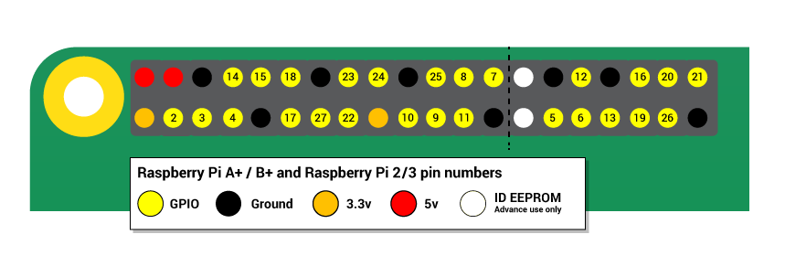
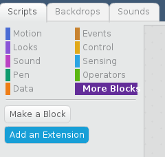
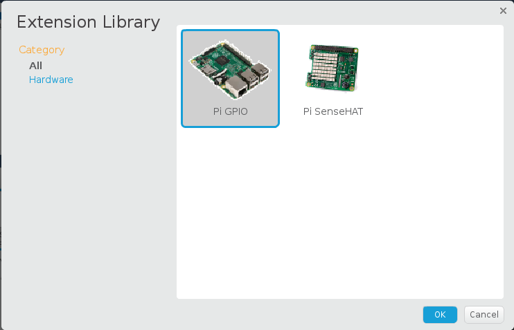
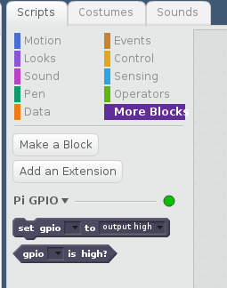
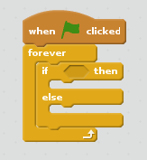
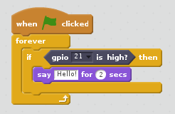

# Physical computing with Scratch 2

## GPIO pins

One powerful feature of the Raspberry Pi is the row of GPIO pins along the top edge of the board. GPIO stands for General-Purpose Input/Output. These pins are a physical interface between the Raspberry Pi and the outside world. At the simplest level, you can think of them as switches that you can turn on or off (input) or that the Pi can turn on or off (output).

The GPIO pins allow the Raspberry Pi to control and monitor the outside world by being connected to electronic circuits. The Pi is able to control LEDs, turning them on or off, run motors, and many other things. It's also able to detect whether a switch has been pressed, the temperature, and light. We refer to this as physical computing.

There are 40 pins on the Raspberry Pi (26 pins on early models), and they provide various different functions.

If you have a RasPiO pin label, it can help to identify what each pin is used for. Make sure your pin label is placed with the keyring hole facing the USB ports, pointed outwards.

If you don't have a pin label, then this guide can help you to identify the pin numbers:

You'll see pins labelled as 3V3, 5V, GND and GP2, GP3, etc:

|   |   |   |
|---|---|---|
| 3V3 | 3.3 volts | Anything connected to these pins will always get 3.3V of power |
| 5V | 5 volts | Anything connected to these pins will always get 5V of power |
| GND | ground | Zero volts, used to complete a circuit |
| GP2 | GPIO pin 2 | These pins are for general-purpose use and can be configured as input or output pins |
| ID_SC/ID_SD/DNC | Special purpose pins ||

**WARNING**: If you follow the instructions, then playing about with the GPIO pins is safe and fun. Randomly plugging wires and power sources into your Pi, however, may destroy it, especially if using the 5V pins. Bad things can also happen if you try to connect things to your Pi that use a lot of power; LEDs are fine, motors are not. If you're worried about this, then you might want to consider using an add-on board such as the [Explorer HAT](https://shop.pimoroni.com/products/explorer-hat) until you're confident enough to use the GPIO directly.

## Lighting an LED

You can test whether your GPIO pins and LEDs are working by building the circuit below. You can use any resistor over about 50Ω.

1. The LED is connected directly to the **GND** pin and the **3V3** pin via the 330 Ohm resistor, and should light up.

1. Be sure to connect your LED the correct way round; the longer leg should be connected to the 3V3 pin:

## Using a switchable pin

1. To control the LED, you'll need to adapt your circuit to use a switchable pin.

1. In the diagram below **pin 17** has been used, but you can use any numbered pin you wish.

## Constructing a Scratch 2 program

1.  Locate the Scratch 2 program by clicking on **Menu** followed by **Programming**, and selecting **Scratch 2**, remember to use version 2, not version 1.

 

1. The familiar Scratch interface will then load:

 

1. We need to setup Scratch to use the GPIO pins. Click on **More Blocks** in the top right display and click on **Add an Extension**.

1. Select Pi GPIO and click on.  

1. You will see two new blocks appear, we will be using these to control and sense the GPIO pins.

1.  Click on **Events** in the top-right (Scripts tab) display. Drag the `when GreenFlag clicked` block onto the scripts area:

  

1. From this point on, you can control your LED using the two new blocks: `set gpio 17 to output high` to turn it on and `set gpio 17 to output low` to turn it off. Using these two messages and some pauses, you can make an LED flash continuously:

  

## Connecting a button

1. As well as controlling the physical world, you can react to it using an input device such as a button.

1. Connect your button to a breadboard, then connect one pin to a ground pin and the other to a numbered GPIO pin. In this example **pin 2** has been used:

`Not this image is incorrect for Scratch 2. The switch needs to be connected to 3v3 rather than Gnd`

## Configuring your button

1. Assuming you have started a new Scratch file, you'll need to check the `Pi GPIO` extension is enabled with the two GPIO blocks available.

1. Next, you need to go to the Data menu in Scratch and create a new variable called `Button`:

  

1. Make sure the check box next to the new variable is checked.

1. You should now see the `button` variable in the stage area:

  

1. You'll now need a code block to read the button and update the `button` variable

1. Pull in the `when green flag clicked` block from the **Event** menu.  Place an `if, then, else` block in a `forever` block at attach to the `when green flag clicked block`

  

1. You need the block to check when the button is pressed, so add `set gpio 21 to output high` from the **more blocks** menu to the `if` block

1. From the **Data** menu drag `set button to 1` into the `then` block

1. From the **Data** menu drag `set button to 0` into the `else` block

  

1. Press the green flag to run the code

1. Now when you press your button, the state should change from 1 to 0.

## Responding to a button press

1. Now that your button is all set up and working, you can make it do something. You can start off by making it control a sprite.

1. Begin with a `forever` loop with an `if` block inside it. This will continually check the `if` condition and perform some action if the condition is met. The action in the example below will make the current sprite say "Hello!":

1. Finally, to make this work you need to add the condition, which is that we want the sprite to speak when the **gpio 21 is high**:

    

If everything is correct, your button should make the sprite speak.

## Controlling an LED with a button push

To finish off, you can combine your two programs so that the button can turn the LED on and off.

1. Adapt your script and use an `If Else` block so that it looks like the example below:

    

1. Now when you push the button, the LED should light up.

## What next?

There are lots of other things you can control or monitor with your Raspberry Pi. Have a look at the worksheets below, to see how easily this can be done.

[Using an active buzzer](buzzer.md)  
[Making traffic lights](trafficlights.md)  
[Using a PIR sensor](pir.md)  
